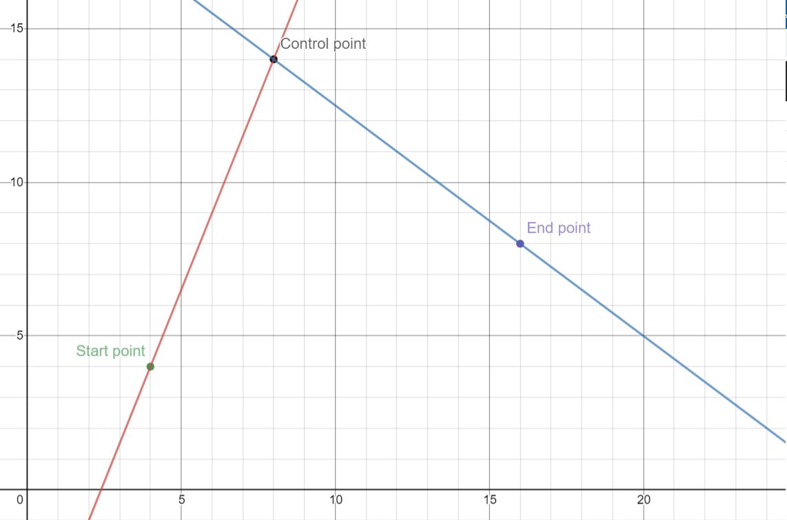

# Quad Spline Interpolation & Bézier Curve

## What is spline interpolation

> In the mathematical  field of numerical analysis, **spline
> interpolation** is a form of interpolation where the interpolant is a
> special type of piecewise polynomial called a spline.

You can read the full article of the [spline interpolation](https://en.wikipedia.org/wiki/Spline_interpolation) on wiki.

## What is Bézier curve

> A **Bézier curve** is a parametric curve used in computer graphics and
> related fields. The curve, which is related to the Bernstein
> polynomial, is named after Pierre Bézier, who used it in the 1960s for
> designing curves for the bodywork of Renault cars. Other uses include
> the design of computer fonts and animation.

You can read the full article of the [Bézier curve](https://en.wikipedia.org/wiki/B%C3%A9zier_curve) on wiki.

## About the project

This project is an implementation of the spline interpolation and Bézier curve theories.

The application takes some coordinates then calculates it's quad equation and finally visualize the graphs using Bézier curve.

Main feature of the application is that you can control the animation speed and the drawing steps, also you can generate the quadratic equations of some points.

## Math

  - ## Quadratic spline interpolation

    Let's assume that we have the following points from 0 to n:
    
    
    What we need is to connect every two points with a quad curve as following:
    
    
    We can see that we have n + 1 points, and actually if we want to connect every two
    points then we will need n equation.
     
     So we can conclude that:
     
    **number of equations = number of points - 1**

    At first you need to know that the general equation of quadratic function is as following:
    
    f(x) =

    So the equations we have are:

    

    

    

    

    

    .\
    .\
    .

    

    We will notice that we have 3 unknowns `a, b, and c` in every equation, so to calculate them we need three equation from the same equation to solve them and calculate the unknowns, so we need `3n` equations.
    Luckily we already know two points values for every equation for ex:
    
    lest assume the first point is (10, 11) and the second one is (12, 15) so we have

    

    

    As we can see we need one more equation to define `a,b, and c` for every quadratic equation.
    Now we need a relation between the curves to conclude the unknowns, 
    let's think about the differentiation what if we differentiate the curve equation ?
    We will get an equation that gives us the slope at any point on the curve.
    Actually we can notice that every two curves have a joint point between them,
    so we can assume that the slope at that point is the same.
    So we can conclude that the differentiation of the curve `i` equals the differentiation of the curve `i + 1`.

    

    let's simplify:

    

    Now after that assumption we have `3n - 1` because of the first two points we don't know what is the slope of the point `(X0, Y0)`, so we need one more equation.
    What if we assumed that the first equation is a linear equation ?
    We will get rid of one unknown right ?
    So actually after that another assumption we need `3n - 1` equations, and we already have those equations.
    Let's just simplify the first line equations:

    

    

    We assumed that the first two points connects with a line so we can say that `a[0] = 0`, then the new equations are:

    

    

    Subtract the two equations:

    )

    

    and we can also conclude that

    )

    Finally now we can calculate the rest of the quadratic equations unknowns using these three equations:

    

    

    

 - ## Quadratic Bézier curve

   In the **Quadratic Bézier curve** all what we need to draw the curve is  three points:

   1. **Start  point** let's call it `SP`
   2. **Control point** let's call it `CP`
   3. **End point** let's call it `EP`

   

   So how we can draw the curve using these three points ?
   We will connect the `SP` with the `CP` using a line let's call it `L1`,
   and connect the `CP` with the `EP` using  another line let's call it `L2` as  following:

   

   Now the main idea of the Bézier curve is that if we moved by some ratio of `L1`
   and we moved the same ratio of `L2` we will get two points that we can connect them by a third line let's call it `L3`.
   In fact if we moved the same ratio of `L3` we will get a point, and the interesting thing is that this point is on the curve that we are trying to draw.
   If we repeated this step by different ratios we will get some points that we can connect them to draw the curve as following:

   

    In the previous  gif we can see that `t` represents the current ratio, and the more the ratio step value was smaller the more the curve will be smoother.
    Now how we can calculate the curve point at `t` ?
    Let's say that `SP = (Xs, Ys), CP = (Xc, Yc), and EP = (Xe, Ye)`.
    We now want to calculate the point on `L1` at `t`. 
    From the following image:

    

    let's call the angle `RX` by `theta`, what if we take the `cos` of that `theta` ?
    We will get the following equation:

    &space;=&space;\frac{X}{R}&space;=&space;\frac{x}{r})

    let's call the previous equation by `Eq1`.
    So what is next ?
    Actually we already know that at ratio `t`,  `r` will equal `t . R` so

    

    let's call previous equation by `Eq2`.
    From `Eq2` into `Eq1`:

    

    

    

    So we can conclude that `Xv = Xs + x`.
    From the same steps but by using `sin(theta)` we can conclude that:

    

    So Yv will be:
    
    Yv = Ys + y
    
    Now what does `Y` and `X` equals ?
    `X` is the difference between `Xc and Xs`, and `Y` is the difference between `Yc and Ys`.
    
    X = Xc - Xs
    Y = Yc - Ys
    
    So finally the important equations will be:

    )

    )

    Now we want to calculate the point on `L2` at `t`. 
    From the following image:

    

    Like the last step we will take `cos` and `sin` to the `YR angle`, and we will conclude that:

    )

    )

    Finally we want to get the point that on the `L3` line.
    From the following image:

    

    from the previous derives we can say:

    )

    )

    After some simplification we can say:

    &space;&plus;&space;2t(Xc&space;-&space;Xs)&space;&plus;&space;Xs)

    &space;&plus;&space;2t(Yc&space;-&space;Ys)&space;&plus;&space;Ys)

    

  - Quadratic equation to Bézier curve

   We know that to draw a Bézier curve we need 3 points `start, end, and control`,
   in this case we already know the start and the end points of the curve, all what we need now is to get the control point.
   The control point of the curve is the cross point of the tangent lines of the first and end points.
   So how we can get the tangent line equation ?
   As we know if we differentiate the curve equation we will get an equation that gives us the slope at any point on the curve right ?
   We can get the slope at the first and end points, then from them we can conclude two linear equation and solve them to get the cross point.
   So we can say that:

   

   

   

   `m1` = 

   `m2` = 

   Note that the general form for any linear equation is `y = mx + b`.
   Then the first line equation will be:
   `y = m1 x + b1`
   and the second line equation is:
   `y = m2 x + b2`
   We already calculated `m1` and `m2`, we need now to calculate `b1` and `b2`.
   What we can do to calculate `b1` and `b2` ?
   Actually we know a point `(start point)` on the first line and a point `(end point)` on the second line right ?
   So we can calculate `b1` and `b2` from them.

   

   

   Now we need to solve the two lines equations to get the cross point:

   )

   &space;&plus;&space;b_1)
   
   After some simplification we can say:

   &space;&plus;&space;b(X_s-X_e)}{2a(X_s&space;-&space;X_e)})

   (\frac{Ye&space;-&space;Ys&space;&plus;&space;2a(X_s^2&space;-&space;X_e^2)&space;&plus;&space;b(X_s&space;-&space;X_e)}{2a(X_s&space;-&space;X_e)}&space;-&space;X_s)&space;&plus;&space;Y_s)

  - ## Summary
    - Number of quadratic equations = number of points - 1
  
    - We will assume that the first equation is a linear equation, So:
  
      
  
      

      )

    - The equation to conclude the rest of the quadratic equations:
  
      
  
      

      

    - To draw Bézier curve we need three points `start, end and control`.
  
    - To get the curve point at a ratio `t` we can use the following equations:
  
      &space;&plus;&space;2t(Xc&space;-&space;Xs)&space;&plus;&space;Xs)
  
      &space;&plus;&space;2t(Yc&space;-&space;Ys)&space;&plus;&space;Ys)

      

    - To convert a quad equation to a Bézier curve we need to calculate the control point, and we can do that with the following equations:
  
      &space;&plus;&space;b(X_s-X_e)}{2a(X_s&space;-&space;X_e)})
    
      (\frac{Ye&space;-&space;Ys&space;&plus;&space;2a(X_s^2&space;-&space;X_e^2)&space;&plus;&space;b(X_s&space;-&space;X_e)}{2a(X_s&space;-&space;X_e)}&space;-&space;X_s)&space;&plus;&space;Y_s)

## Screenshots

